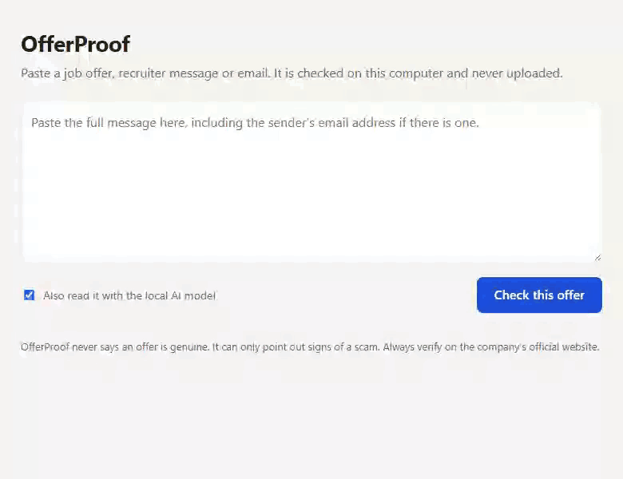

# OfferProof

Check a job offer for scam signs before you reply, pay, or share documents. It runs on your own computer
with an open-weight model, so your offer letter, phone number and PAN never leave it.

Fake job offers mostly target people with little or no work experience. Most of them repeat a few tells:
a fee to "confirm your seat", an interview held over Telegram, a Gmail address claiming to be a large
company. OfferProof looks for those tells and shows you the exact words that triggered each one.



```
$ offerproof check offer.txt

LIKELY SCAM: This message has clear signs of a job scam.

[severe] Personal email claiming to be Infosys
  "infosys.recruitment.cell@gmail.com"
  Large employers recruit from their own company domain, never from Gmail, Yahoo or Outlook.
  Ask them: Can you write to me from your official Infosys email address?

[severe] Asks you to pay money
  "Pay a refundable registration fee of Rs 1,999 within 2 hours to confirm your seat"
  Genuine employers do not charge candidates to apply, train, get verified or join.
  Ask them: Can you confirm from your official company email that there is no fee or deposit at any stage?

[severe] Interview happens only over chat
  "Your interview will be on Telegram"
  ...

Verify: genuine Infosys recruiters write from @infosys.com
```

## How it decides

OfferProof never asks a model whether an offer is fake. A small model's judgement isn't reliable or
explainable enough for that. Instead the work is split:

1. **Pattern rules** ([`signals.yaml`](src/offerproof/data/signals.yaml)) catch known scam wording. They
   ignore negated sentences, so "we never charge a registration fee" doesn't count as asking for one.
2. **Domain checks** ([`companies.yaml`](src/offerproof/data/companies.yaml)) compare the sender's email
   with the company the message claims to be from, catching free-mail addresses and look-alike domains
   such as `tcs-careers.in`.
3. **A local model** (Gemma 3 4B through [Ollama](https://ollama.com)) reads the message and answers
   narrow questions: does it ask for money, for an OTP, for documents? How is the interview held? Every
   answer must quote the message. Quotes that don't appear in the message are discarded, so the model
   can't invent a reason. This catches scams phrased in ways no pattern anticipated.
4. **Plain code makes the verdict.** Any severe sign means *likely scam*. Otherwise the result is
   *unverified*, never *genuine*, because no message can prove an offer is real.

## Install

Requires Python 3.11+. For the model step, install [Ollama](https://ollama.com) and pull the model:

```
ollama pull gemma3:4b
```

Then:

```
git clone https://github.com/Surge77/offerproof.git
cd offerproof
python -m venv .venv
.venv/Scripts/activate        # Windows; use `source .venv/bin/activate` on macOS/Linux
pip install -e .
```

Without Ollama, OfferProof still works and uses the pattern rules and domain checks only.

## Use

**Web page**

```
offerproof serve
```

Open http://127.0.0.1:8766, paste the message and press *Check this offer*. The server only listens on
your own machine.

**Command line**

```
offerproof check offer.txt          # a file
offerproof check -                  # paste, then Ctrl+Z / Ctrl+D
offerproof check offer.txt --json   # full result as JSON
offerproof check offer.txt --no-model
```

Use a different model with `OFFERPROOF_MODEL=<name>` or point at another Ollama server with
`OFFERPROOF_OLLAMA_URL`.

## What it checks

| Signal | Severity |
|---|---|
| Asks you to pay a fee, deposit or "refundable" amount | severe |
| Pays for online tasks (likes, ratings, reviews, wallet top-ups) | severe |
| Interview only over Telegram / WhatsApp / chat | severe |
| Hires without any interview | severe |
| Asks for an OTP, PIN, CVV or banking login | severe |
| Personal email (Gmail, Yahoo...) claiming to be a known company | severe |
| Email domain imitating a known company | severe |
| Asks for Aadhaar, PAN or bank details | caution |
| Pressure to decide within hours | caution |
| Pay that is too good for the work | caution |
| Moves the conversation to Telegram or WhatsApp | caution |

Identity documents are only a caution: real employers do collect them, after a formal offer.

## Measuring it

[`eval/samples.yaml`](eval/samples.yaml) holds labelled scam and genuine messages.

```
python eval/run.py              # rules, model, and both combined
python eval/run.py --no-model
```

It reports how many scams each layer catches and how many genuine messages it wrongly flags.

## Limitations

- It recognises the scams it knows about. A new script with none of these signs gets *unverified*, not
  *safe*, so always confirm a role on the company's official careers page.
- The model step needs about 4 GB of free memory and is slower on machines without a GPU.
- The company list covers employers that are often impersonated in India. Others get no domain check.
- It reads text. Paste the contents of a PDF offer letter rather than the file.

## Adding a scam pattern

Scam scripts change faster than any one person can track. If you've seen one OfferProof misses, add
it: see [CONTRIBUTING.md](CONTRIBUTING.md). Most additions are a line or two of YAML and a test.

## If you've been targeted

Don't pay and don't share OTPs or documents. In India, report it at
[cybercrime.gov.in](https://cybercrime.gov.in) or call **1930**.

## Credits

Scam signs are drawn from public guidance, including the
[Infosys recruitment fraud alert](https://www.infosys.com/careers/job-opportunities/Pages/fraud-alert.aspx)
and Indian Cybercrime Coordination Centre warnings on task-based job fraud.
The model is [Gemma 3](https://ai.google.dev/gemma) by Google, run locally through Ollama.

## License

[MIT](LICENSE)
